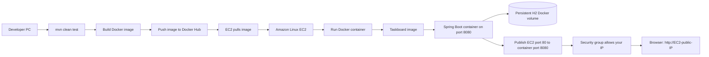
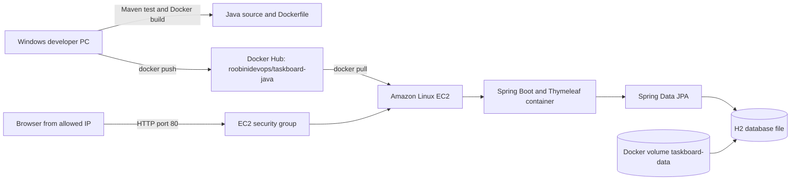
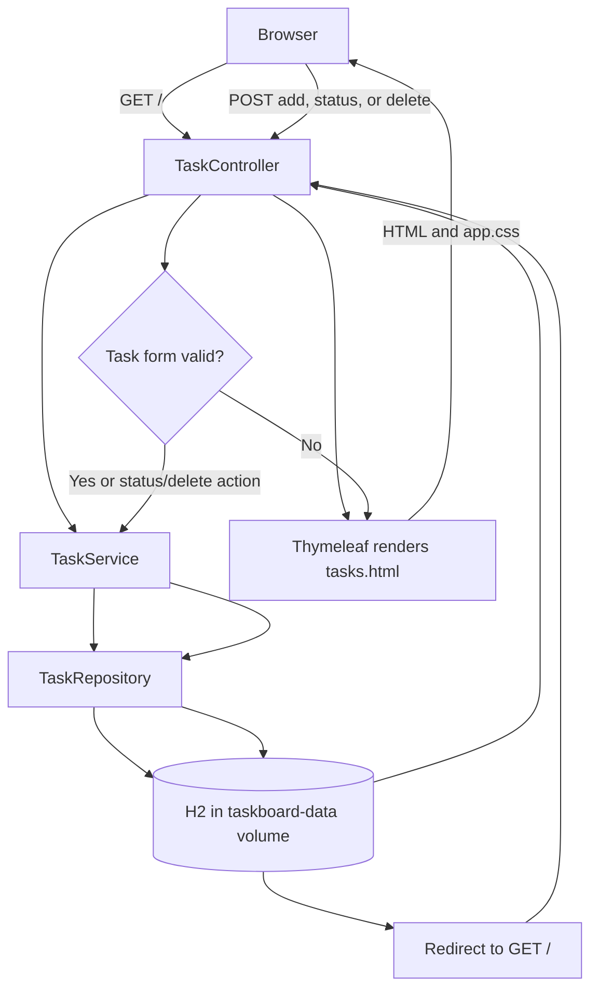

# Build, Test, and Deploy Taskboard to EC2

This guide provisions an Amazon Linux 2023 EC2 instance from Windows PowerShell, restricts SSH and web access to your current public IP, builds and pushes the app image to Docker Hub, then pulls and runs that image on EC2. The app is served over HTTP on port 80 and stores its H2 database in a Docker named volume.

Java and Maven are needed on your Windows machine to test the project locally. Docker Desktop builds the image using the project's multi-stage Dockerfile; EC2 only needs Docker Engine to pull and run the published image.

> **Security and cost:** Taskboard has no login or user accounts. The steps below allow access only from your current public IP; do not expose it publicly with real or sensitive tasks. HTTP is not encrypted. Add authentication and HTTPS before making this a public service. EC2, EBS, and public IPv4 usage may incur AWS charges. Review pricing and terminate resources when finished.

## Build-to-endpoint overview



## Architecture and request flow





## 1. Prepare local tools and test the app

Install Java 21 and Maven by following section 1 of [LOCAL-AND-DOCKER-GUIDE.md](LOCAL-AND-DOCKER-GUIDE.md). Install Docker Desktop and AWS CLI v2 as well:

```powershell
winget install --exact --id Docker.DockerDesktop
winget install --exact --id Amazon.AWSCLI
```

Restart PowerShell, start Docker Desktop, and check the tools:

```powershell
java -version
mvn -version
docker --version
aws --version
```

From the `java-project` directory, run the automated test:

```powershell
mvn clean test
```

Build the executable JAR:

```powershell
mvn clean package
```

Run the application locally to check it before deployment:

```powershell
mvn spring-boot:run
```

Open `http://localhost:8080`, create a task, and verify that it appears. Stop the app with `Ctrl+C`.

Run the Docker image locally before publishing it:

```powershell
docker build -t roobinidevops/taskboard-java:1.0.0 .
docker run --rm -d --name taskboard-test -p 127.0.0.1:18080:8080 roobinidevops/taskboard-java:1.0.0
Invoke-WebRequest -Uri 'http://localhost:18080' -UseBasicParsing | Select-Object -ExpandProperty StatusCode
docker stop taskboard-test
```

The expected response code is `200`. Run these commands from the `java-project` directory.

## 2. Build and publish the image to Docker Hub

The Docker Hub repository is [roobinidevops/taskboard-java](https://hub.docker.com/repository/docker/roobinidevops/taskboard-java). Confirm that the repository exists and that its visibility is **Public** if EC2 should pull without authenticating. If it is private, the EC2 deployment steps below must log in with a Docker Hub access token before pulling.

From the `java-project` directory, build a versioned image and a `latest` tag:

```powershell
docker build -t roobinidevops/taskboard-java:1.0.0 -t roobinidevops/taskboard-java:latest .
```

Create a Docker Hub access token with **Read & Write** permissions for this repository. A read-only token can pull images but cannot push them. Confirm the repository exists under the `roobinidevops` namespace and that this account is allowed to publish to it.

If Docker is already logged in with an old or read-only token, remove the cached credentials first. Then sign in again with the `roobinidevops` username and the new token (enter the token when Docker prompts for a password; do not put it directly in the command):

```powershell
docker logout
docker login --username roobinidevops
```

If prompted, paste the access token—not your Docker Hub account password.

Push both tags to the repository:

```powershell
docker push roobinidevops/taskboard-java:1.0.0
docker push roobinidevops/taskboard-java:latest
```

Verify that the tags appear on the [Docker Hub repository page](https://hub.docker.com/repository/docker/roobinidevops/taskboard-java). Do not put access tokens in this guide, source code, or shell command text.

## GitHub Actions CI/CD (optional)

The app repository calls the reusable workflow in
[ci-cd-pipelines](https://github.com/Roobini-code/ci-cd-pipelines). Pull
requests targeting `main` run Maven verification and build the Docker image
without publishing or deploying. After a pull request is merged to `main`, the
workflow publishes the image to Docker Hub, deploys it over SSH to EC2, checks
that the app responds, and creates a Git tag in this repository.

In the `java-project` GitHub repository, open **Settings → Secrets and variables
→ Actions → New repository secret** and add:

| Secret | Value |
| --- | --- |
| `DOCKERHUB_USERNAME` | Docker Hub username with permission to publish to `roobinidevops/taskboard-java` |
| `DOCKERHUB_TOKEN` | Docker Hub access token with Read & Write permission |
| `EC2_HOST` | Instance public DNS name or IP address, without `http://` |
| `EC2_SSH_PRIVATE_KEY` | Contents of the private `.pem` key used for the EC2 instance |
| `EC2_KNOWN_HOSTS` | Verified SSH host-key entry for the instance |

To populate `EC2_KNOWN_HOSTS`, first connect from a trusted machine and verify
the EC2 SSH host key. Copy the matching entry from that machine's
`~/.ssh/known_hosts` into the secret; the hostname or IP in that entry must
match `EC2_HOST`. The instance must have Docker installed, use the `ec2-user`
account, and allow that user to run Docker with `sudo`.
GitHub-hosted runner IP addresses change, so allow their SSH traffic as
appropriate for your security requirements; use a self-hosted runner or AWS
Systems Manager if you need a stable, restricted deployment path.

On each successful deployment, the workflow uses the Maven version plus the
GitHub Actions run number and attempt to create a unique Git tag, for example
`v1.0.0-42.1`. It pushes the corresponding versioned Docker image and also
updates `latest`. The app's existing `taskboard-data` Docker volume is retained.
Fork pull requests do not receive repository secrets and only run the
verification and image-build steps. The caller workflow needs
`contents: write` permission to create tags; protect `main` and require merges
through pull requests if deployment should only happen after a review.

## 3. Configure AWS CLI credentials

You need an AWS account and an IAM identity authorized to describe VPCs and AMIs, create a key pair and security group, authorize security-group rules, launch and describe EC2 instances, and terminate them. Prefer your organization's IAM Identity Center (SSO) role with least-privilege access.

Configure an SSO profile. The command prompts for your organization's SSO start URL, SSO region, account, role, and default AWS Region:

```powershell
aws configure sso --profile taskboard-deploy
```

Sign in and verify the selected account:

```powershell
aws sso login --profile taskboard-deploy
aws sts get-caller-identity --profile taskboard-deploy
```

If your organization does not use IAM Identity Center, configure an approved IAM profile instead. Do not put access keys in this guide or source code:

```powershell
aws configure --profile taskboard-deploy
aws sts get-caller-identity --profile taskboard-deploy
```

## 4. Set deployment variables

Run these commands in the same PowerShell window for all AWS and SSH steps. Choose a Region where you are allowed to create resources. The commands use a default VPC, Amazon Linux 2023, and an x86-64 `t3.small` instance.

```powershell
$Profile = 'taskboard-deploy'
$Region = 'us-east-1'
$KeyName = 'taskboard-key'
$KeyPath = Join-Path $HOME "$KeyName.pem"
$GroupName = 'taskboard-web-sg'
$ProjectPath = (Get-Location).Path
```

Check the current public IPv4 address. The security group will permit SSH and HTTP only from this address:

```powershell
$MyIp = (Invoke-RestMethod -Uri 'https://checkip.amazonaws.com').Trim()
$MyIp
```

If your internet provider changes your public IP, update the two inbound rules in the EC2 security group before reconnecting.

## 5. Create the EC2 key pair and security group

Create a key pair and save its private key locally. AWS only returns the private key at creation time; keep this file private and backed up securely:

```powershell
aws ec2 create-key-pair --key-name $KeyName --query KeyMaterial --output text --profile $Profile --region $Region | Set-Content -Encoding ascii $KeyPath
```

Restrict access to the key file on Windows:

```powershell
icacls $KeyPath /inheritance:r /grant:r "$($env:USERNAME):(R)"
```

Find the default VPC:

```powershell
$VpcId = aws ec2 describe-vpcs --filters Name=isDefault,Values=true --query 'Vpcs[0].VpcId' --output text --profile $Profile --region $Region
$VpcId
```

If this returns `None`, choose or create a VPC and subnet in the AWS Console before continuing. Create a security group in the default VPC:

```powershell
$SecurityGroupId = aws ec2 create-security-group --group-name $GroupName --description 'Taskboard EC2 web access' --vpc-id $VpcId --query GroupId --output text --profile $Profile --region $Region
$SecurityGroupId
```

Allow SSH on port 22 only from your current IP:

```powershell
aws ec2 authorize-security-group-ingress --group-id $SecurityGroupId --protocol tcp --port 22 --cidr "$MyIp/32" --profile $Profile --region $Region
```

Allow HTTP on port 80 only from your current IP:

```powershell
aws ec2 authorize-security-group-ingress --group-id $SecurityGroupId --protocol tcp --port 80 --cidr "$MyIp/32" --profile $Profile --region $Region
```

Do not add an inbound rule for port 8080. Docker maps EC2 port 80 to the app's container port 8080.

## 6. Launch the EC2 instance

Look up the latest Amazon Linux 2023 x86-64 AMI in the selected Region:

```powershell
$AmiId = aws ssm get-parameter --name '/aws/service/ami-amazon-linux-latest/al2023-ami-kernel-default-x86_64' --query Parameter.Value --output text --profile $Profile --region $Region
$AmiId
```

Launch one instance. Check current AWS pricing before running it:

```powershell
$InstanceId = aws ec2 run-instances --image-id $AmiId --instance-type t3.small --key-name $KeyName --security-group-ids $SecurityGroupId --count 1 --tag-specifications 'ResourceType=instance,Tags=[{Key=Name,Value=taskboard-ec2}]' --query 'Instances[0].InstanceId' --output text --profile $Profile --region $Region
$InstanceId
```

Wait for EC2 status checks to pass:

```powershell
aws ec2 wait instance-status-ok --instance-ids $InstanceId --profile $Profile --region $Region
```

Get the public IP and DNS name:

```powershell
$PublicIp = aws ec2 describe-instances --instance-ids $InstanceId --query 'Reservations[0].Instances[0].PublicIpAddress' --output text --profile $Profile --region $Region
$PublicDns = aws ec2 describe-instances --instance-ids $InstanceId --query 'Reservations[0].Instances[0].PublicDnsName' --output text --profile $Profile --region $Region
$PublicIp
$PublicDns
```

## 7. Connect to EC2 over SSH

From the same PowerShell window on Windows, connect as the Amazon Linux default user:

```powershell
ssh -i $KeyPath "ec2-user@$PublicIp"
```

On the first connection, verify the host prompt and type `yes`. The commands in the next section run in the SSH terminal on EC2, not in local PowerShell.

## 8. Install Docker Engine on EC2

Update Amazon Linux and install Docker plus archive utilities:

```bash
sudo dnf update -y
sudo dnf install -y docker curl
```

Enable Docker now and at boot:

```bash
sudo systemctl enable --now docker
```

Verify Docker:

```bash
sudo docker --version
```

## 9. Pull the image and start the app on EC2

Continue in the EC2 SSH terminal from the previous section. If the Docker Hub repository is public, pull the versioned image without logging in:

```bash
sudo docker pull roobinidevops/taskboard-java:1.0.0
```

If the repository is private, authenticate as the Docker Hub user with a Docker Hub access token. The token input is hidden; do not paste the token into the guide or source files:

```bash
read -rsp 'Docker Hub access token: ' DOCKERHUB_TOKEN
echo
printf '%s' "$DOCKERHUB_TOKEN" | sudo docker login --username roobinidevops --password-stdin
unset DOCKERHUB_TOKEN
sudo docker pull roobinidevops/taskboard-java:1.0.0
```

Create a named volume for persistent H2 database storage, then run the container. The volume survives container replacement and restart:

```bash
sudo docker volume create taskboard-data
sudo docker run -d \
  --name taskboard \
  --restart unless-stopped \
  -p 80:8080 \
  -e PORT=8080 \
  -e DATA_DIR=/data \
  -v taskboard-data:/data \
  roobinidevops/taskboard-java:1.0.0
```

Check container status and startup logs:

```bash
sudo docker ps
sudo docker logs --tail=100 taskboard
```

Check the app locally on the EC2 instance:

```bash
curl -I http://localhost
```

Back in local PowerShell, check the deployed app using its public IP:

```powershell
Invoke-WebRequest -Uri "http://$PublicIp" -UseBasicParsing | Select-Object -ExpandProperty StatusCode
```

The expected response code is `200`. Browse to `http://<EC2-public-IP>` and try creating and updating a task. Because inbound port 80 is restricted to your current IP, other networks cannot open the page.

## 10. Update the deployed image

After changing code, run tests and build/push a new version from local PowerShell. Increment the version tag each time (for example, use `1.0.1` next):

```powershell
Set-Location $ProjectPath
mvn clean test
docker build -t roobinidevops/taskboard-java:1.0.1 -t roobinidevops/taskboard-java:latest .
docker push roobinidevops/taskboard-java:1.0.1
docker push roobinidevops/taskboard-java:latest
```

Reconnect to EC2 if needed:

```powershell
ssh -i $KeyPath "ec2-user@$PublicIp"
```

Run the following on EC2 to pull the new image, replace the container, and retain the database volume:

```bash
sudo docker pull roobinidevops/taskboard-java:1.0.1
sudo docker rm -f taskboard
sudo docker run -d \
  --name taskboard \
  --restart unless-stopped \
  -p 80:8080 \
  -e PORT=8080 \
  -e DATA_DIR=/data \
  -v taskboard-data:/data \
  roobinidevops/taskboard-java:1.0.1
sudo docker ps
sudo docker logs --tail=100 taskboard
```

The named volume is reused when the container is replaced, so task data remains. If the Docker Hub repository is private, authenticate on EC2 again if its saved registry credentials are unavailable.

## 11. Stop the app and clean up AWS resources

To stop the app but keep the container and database volume, run on EC2:

```bash
sudo docker stop taskboard
```

To restart it later:

```bash
sudo docker start taskboard
```

To permanently remove the app and its stored tasks from EC2, remove the container and named volume. Only run these if you intend to erase the data:

```bash
sudo docker rm -f taskboard
sudo docker volume rm taskboard-data
```

To stop AWS instance charges, run in local PowerShell:

```powershell
aws ec2 terminate-instances --instance-ids $InstanceId --profile $Profile --region $Region
aws ec2 wait instance-terminated --instance-ids $InstanceId --profile $Profile --region $Region
```

After the instance is terminated, delete the security group and AWS-side key-pair record:

```powershell
aws ec2 delete-security-group --group-id $SecurityGroupId --profile $Profile --region $Region
aws ec2 delete-key-pair --key-name $KeyName --profile $Profile --region $Region
```

The private key file remains on your PC until you delete it. Keep it if you need it for another instance; otherwise remove it deliberately:

```powershell
Remove-Item $KeyPath
```

## Troubleshooting

- `Permission denied (publickey)`: confirm the username is `ec2-user`, the key path is correct, and the instance was launched with this key pair.
- SSH times out: confirm the instance is running, your current IP still matches the port 22 security-group rule, and the selected subnet has a public route.
- The website times out: confirm the port 80 security-group rule contains your current IP, then run `sudo docker ps` and `sudo docker logs --tail=100 taskboard` on EC2.
- `pull access denied` or `manifest unknown`: confirm the repository is public or log in to Docker Hub on EC2, and check that the requested image tag exists.
- `authentication required - access token has insufficient scopes` when pushing: create a Docker Hub access token with **Read & Write** permissions, run `docker logout`, sign in again as `roobinidevops` with that token, and verify the account has permission to publish to `roobinidevops/taskboard-java`.
- `port is already allocated`: another process or container is using host port 80; inspect containers with `sudo docker ps` before changing the port mapping.
- Public IP changed: retrieve the current address with `aws ec2 describe-instances` and update the `$PublicIp` variable and security-group ingress rules. A stopped and restarted instance may receive a different public IP unless you allocate an Elastic IP.