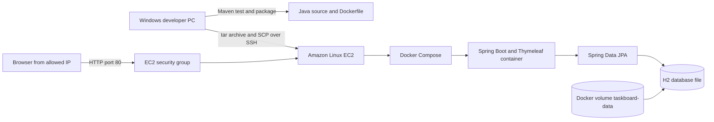
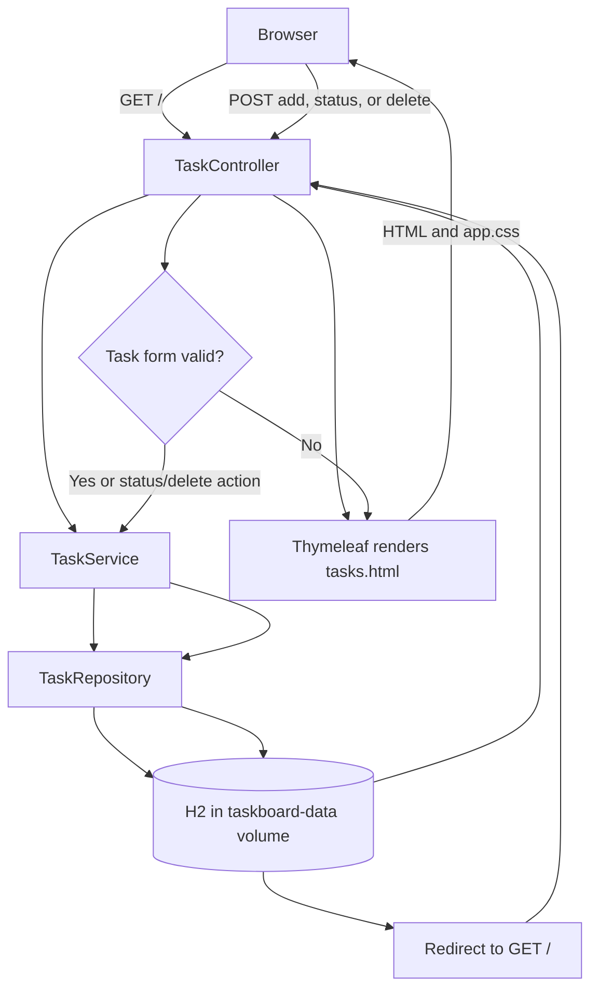

# Build, Test, and Deploy Taskboard to EC2

This guide provisions an Amazon Linux 2023 EC2 instance from Windows PowerShell, restricts SSH and web access to your current public IP, copies this project to the instance, installs Docker Engine and the Docker Compose plugin, then runs the app. The app is served over HTTP on port 80 and stores its H2 database in a Docker named volume.

Java and Maven are needed on your Windows machine to test the project locally. EC2 does not need a separately installed JDK or Maven because the Docker build image supplies them and the runtime image contains Java.

> **Security and cost:** Taskboard has no login or user accounts. The steps below allow access only from your current public IP; do not expose it publicly with real or sensitive tasks. HTTP is not encrypted. Add authentication and HTTPS before making this a public service. EC2, EBS, and public IPv4 usage may incur AWS charges. Review pricing and terminate resources when finished.

## Architecture and request flow





## 1. Prepare local tools and test the app

Install Java 21 and Maven by following section 1 of [LOCAL-AND-DOCKER-GUIDE.md](LOCAL-AND-DOCKER-GUIDE.md). Install Docker Desktop and AWS CLI v2 as well:

```powershell
winget install --exact --id Docker.DockerDesktop
winget install --exact --id Amazon.AWSCLI
```

Restart PowerShell, start Docker Desktop, and check the tools:

```powershell
java -version
mvn -version
docker --version
docker compose version
aws --version
```

Change to the project folder and run the automated test:

```powershell
Set-Location 'C:\Users\D E L L\Downloads\github-code\java-project'
mvn clean test
```

Build the executable JAR:

```powershell
mvn clean package
```

Run the application locally to check it before deployment:

```powershell
mvn spring-boot:run
```

Open `http://localhost:8080`, create a task, and verify that it appears. Stop the app with `Ctrl+C`.

You can also verify the Docker build locally:

```powershell
docker compose config
docker compose build
```

## 2. Configure AWS CLI credentials

You need an AWS account and an IAM identity authorized to describe VPCs and AMIs, create a key pair and security group, authorize security-group rules, launch and describe EC2 instances, and terminate them. Prefer your organization's IAM Identity Center (SSO) role with least-privilege access.

Configure an SSO profile. The command prompts for your organization's SSO start URL, SSO region, account, role, and default AWS Region:

```powershell
aws configure sso --profile taskboard-deploy
```

Sign in and verify the selected account:

```powershell
aws sso login --profile taskboard-deploy
aws sts get-caller-identity --profile taskboard-deploy
```

If your organization does not use IAM Identity Center, configure an approved IAM profile instead. Do not put access keys in this guide, source code, or deployment archive:

```powershell
aws configure --profile taskboard-deploy
aws sts get-caller-identity --profile taskboard-deploy
```

## 3. Set deployment variables

Run these commands in the same PowerShell window for all AWS and SSH steps. Choose a Region where you are allowed to create resources. The commands use a default VPC, Amazon Linux 2023, and an x86-64 `t3.small` instance.

```powershell
$Profile = 'taskboard-deploy'
$Region = 'us-east-1'
$KeyName = 'taskboard-key'
$KeyPath = Join-Path $HOME "$KeyName.pem"
$GroupName = 'taskboard-web-sg'
$ProjectPath = 'C:\Users\D E L L\Downloads\github-code\java-project'
$ArchivePath = Join-Path $env:TEMP 'taskboard-deploy.tar.gz'
```

Check the current public IPv4 address. The security group will permit SSH and HTTP only from this address:

```powershell
$MyIp = (Invoke-RestMethod -Uri 'https://checkip.amazonaws.com').Trim()
$MyIp
```

If your internet provider changes your public IP, update the two inbound rules in the EC2 security group before reconnecting.

## 4. Create the EC2 key pair and security group

Create a key pair and save its private key locally. AWS only returns the private key at creation time; keep this file private and backed up securely:

```powershell
aws ec2 create-key-pair --key-name $KeyName --query KeyMaterial --output text --profile $Profile --region $Region | Set-Content -Encoding ascii $KeyPath
```

Restrict access to the key file on Windows:

```powershell
icacls $KeyPath /inheritance:r /grant:r "$($env:USERNAME):(R)"
```

Find the default VPC:

```powershell
$VpcId = aws ec2 describe-vpcs --filters Name=isDefault,Values=true --query 'Vpcs[0].VpcId' --output text --profile $Profile --region $Region
$VpcId
```

If this returns `None`, choose or create a VPC and subnet in the AWS Console before continuing. Create a security group in the default VPC:

```powershell
$SecurityGroupId = aws ec2 create-security-group --group-name $GroupName --description 'Taskboard EC2 web access' --vpc-id $VpcId --query GroupId --output text --profile $Profile --region $Region
$SecurityGroupId
```

Allow SSH on port 22 only from your current IP:

```powershell
aws ec2 authorize-security-group-ingress --group-id $SecurityGroupId --protocol tcp --port 22 --cidr "$MyIp/32" --profile $Profile --region $Region
```

Allow HTTP on port 80 only from your current IP:

```powershell
aws ec2 authorize-security-group-ingress --group-id $SecurityGroupId --protocol tcp --port 80 --cidr "$MyIp/32" --profile $Profile --region $Region
```

Do not add an inbound rule for port 8080. The app's container port is mapped to EC2 port 80 by Compose.

## 5. Launch the EC2 instance

Look up the latest Amazon Linux 2023 x86-64 AMI in the selected Region:

```powershell
$AmiId = aws ssm get-parameter --name '/aws/service/ami-amazon-linux-latest/al2023-ami-kernel-default-x86_64' --query Parameter.Value --output text --profile $Profile --region $Region
$AmiId
```

Launch one instance. `t3.small` has more memory than a micro instance for the first Docker image build; check current AWS pricing before running it:

```powershell
$InstanceId = aws ec2 run-instances --image-id $AmiId --instance-type t3.small --key-name $KeyName --security-group-ids $SecurityGroupId --count 1 --tag-specifications 'ResourceType=instance,Tags=[{Key=Name,Value=taskboard-ec2}]' --query 'Instances[0].InstanceId' --output text --profile $Profile --region $Region
$InstanceId
```

Wait for EC2 status checks to pass:

```powershell
aws ec2 wait instance-status-ok --instance-ids $InstanceId --profile $Profile --region $Region
```

Get the public IP and DNS name:

```powershell
$PublicIp = aws ec2 describe-instances --instance-ids $InstanceId --query 'Reservations[0].Instances[0].PublicIpAddress' --output text --profile $Profile --region $Region
$PublicDns = aws ec2 describe-instances --instance-ids $InstanceId --query 'Reservations[0].Instances[0].PublicDnsName' --output text --profile $Profile --region $Region
$PublicIp
$PublicDns
```

## 6. Connect to EC2 over SSH

From the same PowerShell window on Windows, connect as the Amazon Linux default user:

```powershell
ssh -i $KeyPath "ec2-user@$PublicIp"
```

On the first connection, verify the host prompt and type `yes`. The commands in the next section run in the SSH terminal on EC2, not in local PowerShell.

## 7. Install Docker Engine and Compose on EC2

Update Amazon Linux and install Docker plus archive utilities:

```bash
sudo dnf update -y
sudo dnf install -y docker curl tar gzip
```

Enable Docker now and at boot:

```bash
sudo systemctl enable --now docker
```

Install the Docker Compose v2 CLI plugin for this x86-64 EC2 instance:

```bash
sudo mkdir -p /usr/local/lib/docker/cli-plugins
sudo curl -fSL https://github.com/docker/compose/releases/download/v2.39.4/docker-compose-linux-x86_64 -o /usr/local/lib/docker/cli-plugins/docker-compose
sudo chmod +x /usr/local/lib/docker/cli-plugins/docker-compose
```

Verify both tools:

```bash
sudo docker --version
sudo docker compose version
```

## 8. Copy the app to EC2 and start it

In the EC2 SSH terminal, create a deployment folder and return to the local PowerShell window:

```bash
mkdir -p ~/taskboard
exit
```

In local PowerShell, create a source archive. It excludes Git history, local database files, and Maven build output:

```powershell
tar -czf $ArchivePath --exclude=.git --exclude=target --exclude=data --exclude=.env -C $ProjectPath .
```

Copy the archive to the EC2 home directory:

```powershell
scp -i $KeyPath $ArchivePath "ec2-user@${PublicIp}:/home/ec2-user/taskboard-deploy.tar.gz"
```

Connect again:

```powershell
ssh -i $KeyPath "ec2-user@$PublicIp"
```

In the EC2 SSH terminal, extract the project and configure Compose to publish HTTP on port 80:

```bash
tar -xzf ~/taskboard-deploy.tar.gz -C ~/taskboard
cd ~/taskboard
printf 'APP_PORT=80\n' > .env
```

Build the application image on EC2 and start the service:

```bash
sudo docker compose up --build --detach
```

Check that the container is running and inspect the startup log:

```bash
sudo docker compose ps
sudo docker compose logs --tail=100 app
```

Check the app locally on the instance:

```bash
curl -I http://localhost
```

Back in local PowerShell, open the deployed app using its public IP:

```powershell
Invoke-WebRequest -Uri "http://$PublicIp" -UseBasicParsing | Select-Object -ExpandProperty StatusCode
```

The expected response code is `200`. Browse to `http://<EC2-public-IP>` and try creating and updating a task. Because inbound port 80 is restricted to your current IP, other networks cannot open the page.

## 9. Update the deployment

After changing code, run tests locally:

```powershell
Set-Location $ProjectPath
mvn clean test
```

Create and copy a fresh archive from local PowerShell:

```powershell
tar -czf $ArchivePath --exclude=.git --exclude=target --exclude=data --exclude=.env -C $ProjectPath .
scp -i $KeyPath $ArchivePath "ec2-user@${PublicIp}:/home/ec2-user/taskboard-deploy.tar.gz"
```

Reconnect to EC2:

```powershell
ssh -i $KeyPath "ec2-user@$PublicIp"
```

Run these next commands in the EC2 SSH terminal:

```bash
tar -xzf ~/taskboard-deploy.tar.gz -C ~/taskboard
cd ~/taskboard
sudo docker compose up --build --detach
sudo docker compose ps
```

The named volume is preserved when the app is rebuilt, so task data remains. The `.env` file with `APP_PORT=80` is not part of the source archive and remains on the instance.

## 10. Stop the app and clean up AWS resources

To stop the app but keep the container configuration and database volume, run on EC2:

```bash
cd ~/taskboard
sudo docker compose down
```

To restart it later:

```bash
cd ~/taskboard
sudo docker compose up --detach
```

To permanently remove the app's stored tasks from EC2, remove the named volume as well. Only run this if you intend to erase the data:

```bash
cd ~/taskboard
sudo docker compose down --volumes
```

To stop AWS instance charges, run in local PowerShell:

```powershell
aws ec2 terminate-instances --instance-ids $InstanceId --profile $Profile --region $Region
aws ec2 wait instance-terminated --instance-ids $InstanceId --profile $Profile --region $Region
```

After the instance is terminated, delete the security group and AWS-side key-pair record:

```powershell
aws ec2 delete-security-group --group-id $SecurityGroupId --profile $Profile --region $Region
aws ec2 delete-key-pair --key-name $KeyName --profile $Profile --region $Region
```

The private key file remains on your PC until you delete it. Keep it if you need it for another instance; otherwise remove it deliberately:

```powershell
Remove-Item $KeyPath
```

## Troubleshooting

- `Permission denied (publickey)`: confirm the username is `ec2-user`, the key path is correct, and the instance was launched with this key pair.
- SSH times out: confirm the instance is running, your current IP still matches the port 22 security-group rule, and the selected subnet has a public route.
- The website times out: confirm the port 80 security-group rule contains your current IP, then run `sudo docker compose ps` and `sudo docker compose logs --tail=100 app` on EC2.
- `docker compose` is not a command: verify the plugin exists at `/usr/local/lib/docker/cli-plugins/docker-compose`, is executable, and invoke it as `sudo docker compose`.
- Public IP changed: retrieve the current address with `aws ec2 describe-instances` and update the `$PublicIp` variable and security-group ingress rules. A stopped and restarted instance may receive a different public IP unless you allocate an Elastic IP.