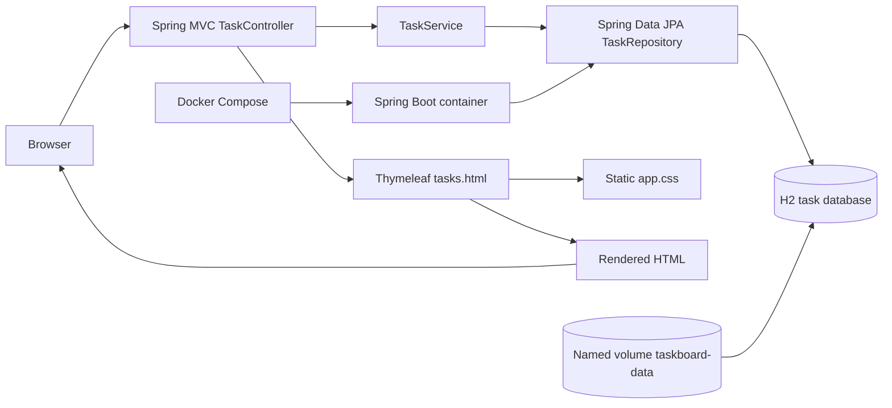
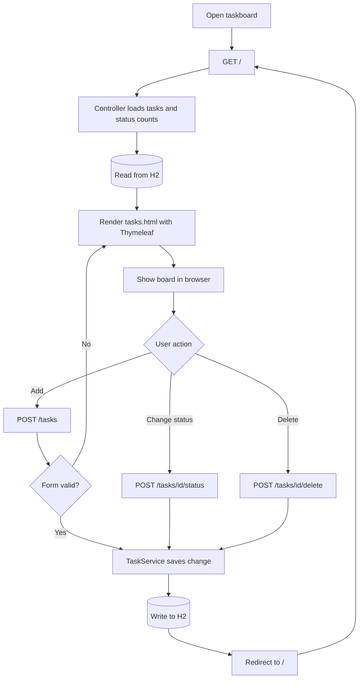

# Taskboard Setup and Deployment Guide

Taskboard is a Java 21 / Spring Boot web application. It stores tasks in an H2 database file. When run directly, the database is in `data/taskboard.mv.db`; with Docker Compose, it is stored in a named Docker volume and survives container restarts.

## Architecture and request flow





## 1. Install the tools on Windows

Open **PowerShell**. Check that Windows Package Manager is available:

```powershell
winget --version
```

Install the Java 21 JDK:

```powershell
winget install --exact --id EclipseAdoptium.Temurin.21.JDK
```

Install Apache Maven for running the project directly on Windows:

```powershell
winget install --exact --id Apache.Maven
```

Install Docker Desktop for the container workflow:

```powershell
winget install --exact --id Docker.DockerDesktop
```

If Windows asks for permission, approve the installation. Restart PowerShell after the installs so the updated `PATH` is loaded. Start Docker Desktop from the Start menu and wait until it reports that Docker is running. If prompted, enable the WSL 2 backend and restart Windows.

Confirm the installations in a new PowerShell window:

```powershell
java -version
mvn -version
docker --version
docker compose version
```

Java and Maven are needed for the native run steps below. Docker Desktop alone is enough to build and run the app using Compose because the Dockerfile supplies Java and Maven inside the build image.

## 2. Run and test locally with Java

Change to the project directory:

```powershell
Set-Location 'C:\Users\D E L L\Downloads\github-code\java-project'
```

Run the automated web application test:

```powershell
mvn test
```

Start the app:

```powershell
mvn spring-boot:run
```

Open this address in a browser:

```text
http://localhost:8080
```

Or check that the local server responds from a second PowerShell window:

```powershell
Invoke-WebRequest -Uri 'http://localhost:8080' -UseBasicParsing | Select-Object -ExpandProperty StatusCode
```

The expected status code is `200`. Add a task, change its status, and delete it in the browser. Press `Ctrl+C` in the app's PowerShell window to stop it. Locally created data remains in the project's `data` folder when the app stops.

To create the executable JAR after the test passes:

```powershell
mvn clean package
```

Run the packaged app:

```powershell
java -jar .\target\taskboard.jar
```

## 3. Build and deploy with Docker Compose

Change to the project directory if needed:

```powershell
Set-Location 'C:\Users\D E L L\Downloads\github-code\java-project'
```

Build the image and start the app in the background:

```powershell
docker compose up --build --detach
```

Check the container state:

```powershell
docker compose ps
```

Read the application logs:

```powershell
docker compose logs --follow app
```

Press `Ctrl+C` to stop following logs; this does not stop the app. Open the app at:

```text
http://localhost:8080
```

Check the HTTP response from PowerShell:

```powershell
Invoke-WebRequest -Uri 'http://localhost:8080' -UseBasicParsing | Select-Object -ExpandProperty StatusCode
```

To stop the app and remove its container and network while keeping task data:

```powershell
docker compose down
```

To start it again later:

```powershell
docker compose up --detach
```

Task data is stored in the `taskboard-data` named volume, not in the container. To permanently remove the app's stored tasks as well as its containers, run this only when you intend to erase that data:

```powershell
docker compose down --volumes
```

### Use another host port

If port 8080 is already occupied, select port 8081 for the current PowerShell session and start Compose:

```powershell
$env:APP_PORT = '8081'
docker compose up --build --detach
```

Open `http://localhost:8081`. To return to the default port in that PowerShell window:

```powershell
Remove-Item Env:APP_PORT
```

## 4. Common checks

If Maven or Java is reported as an unknown command, open a new PowerShell window and retry the version checks in section 1. If Docker commands fail, start Docker Desktop and wait for its engine to finish starting. If the page does not load, inspect the app logs with `docker compose logs --follow app` and confirm the published port with `docker compose ps`.

Do not run `docker compose down --volumes` unless you intend to permanently delete the tasks saved in the Docker volume.