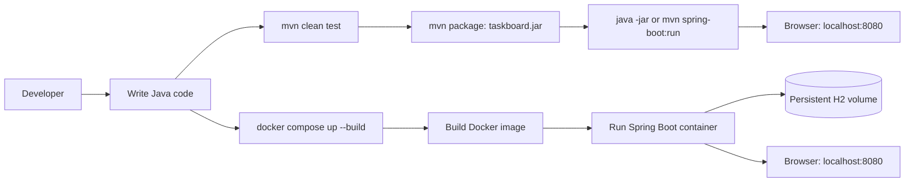
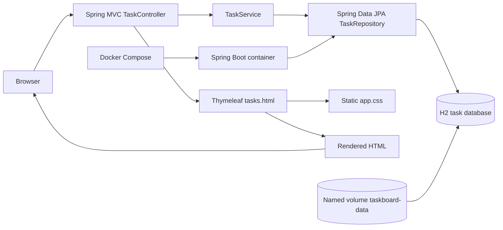
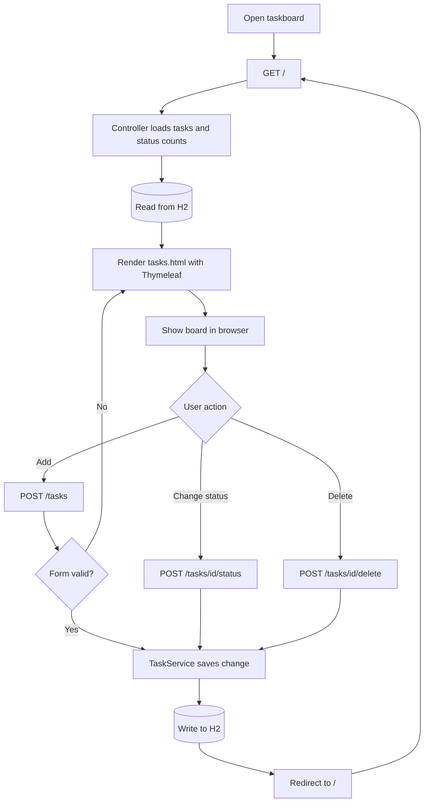

# Taskboard Setup and Deployment Guide

Taskboard is a Java 21 / Spring Boot web application. It stores tasks in an H2 database file. When run directly, the database is in `data/taskboard.mv.db`; with Docker Compose, it is stored in a named Docker volume and survives container restarts.

## Build-to-endpoint overview



## Architecture and request flow





## 1. Install the tools on Windows

Run these commands in PowerShell:

```powershell
winget --version
```

Install Java 21 and configure the current PowerShell window:

```powershell
if (-not (Get-ChildItem 'C:\Program Files\Eclipse Adoptium' -Directory -Filter 'jdk-21*' -ErrorAction SilentlyContinue)) {
    winget install --exact --id EclipseAdoptium.Temurin.21.JDK
}
$Jdk = Get-ChildItem 'C:\Program Files\Eclipse Adoptium' -Directory -Filter 'jdk-21*' | Sort-Object LastWriteTime -Descending | Select-Object -First 1
$JdkHome = $Jdk.FullName
$JdkBin = Join-Path $JdkHome 'bin'
$env:JAVA_HOME = $JdkHome
$env:Path = "$JdkBin;$env:Path"
[Environment]::SetEnvironmentVariable('JAVA_HOME', $JdkHome, 'User')
$UserPath = [Environment]::GetEnvironmentVariable('Path', 'User')
$PathEntries = @($UserPath -split ';' | Where-Object { $_ })
if ($PathEntries -notcontains $JdkBin) { $PathEntries += $JdkBin }
[Environment]::SetEnvironmentVariable('Path', ($PathEntries -join ';'), 'User')
java -version
```

Install Maven and configure the current PowerShell window:

```powershell
$MavenVersion = '3.10.0'
$ToolsDirectory = Join-Path $HOME 'tools'
$MavenHome = Join-Path $ToolsDirectory "apache-maven-$MavenVersion"
$MavenCommand = Join-Path $MavenHome 'bin\mvn.cmd'
if (-not (Test-Path $MavenCommand)) {
    $MavenZip = Join-Path $env:TEMP "apache-maven-$MavenVersion-bin.zip"
    New-Item -ItemType Directory -Force -Path $ToolsDirectory | Out-Null
    Invoke-WebRequest -Uri "https://dlcdn.apache.org/maven/maven-3/$MavenVersion/binaries/apache-maven-$MavenVersion-bin.zip" -OutFile $MavenZip
    Expand-Archive -Path $MavenZip -DestinationPath $ToolsDirectory -Force
}
$env:MAVEN_HOME = $MavenHome
$MavenBin = Join-Path $MavenHome 'bin'
$env:Path = "$MavenBin;$env:JAVA_HOME\bin;$env:Path"
[Environment]::SetEnvironmentVariable('MAVEN_HOME', $MavenHome, 'User')
$UserPath = [Environment]::GetEnvironmentVariable('Path', 'User')
$PathEntries = @($UserPath -split ';' | Where-Object { $_ })
if ($PathEntries -notcontains $MavenBin) { $PathEntries += $MavenBin }
[Environment]::SetEnvironmentVariable('Path', ($PathEntries -join ';'), 'User')
mvn -version
```

Install and start Docker Desktop:

```powershell
winget install --exact --id Docker.DockerDesktop
Start-Process "$env:ProgramFiles\Docker\Docker\Docker Desktop.exe"
```

Install AWS CLI only for EC2 deployment:

```powershell
winget install --exact --id Amazon.AWSCLI
```

Verify the prerequisites:

```powershell
java -version
mvn -version
docker --version
docker compose version
```

## 2. Run and test locally with Java

Run the following commands from the `java-project` directory.

Run the automated web application test:

```powershell
mvn test
```

Start the app:

```powershell
mvn spring-boot:run
```

Open this address in a browser:

```text
http://localhost:8080
```

Or check that the local server responds from a second PowerShell window:

```powershell
Invoke-WebRequest -Uri 'http://localhost:8080' -UseBasicParsing | Select-Object -ExpandProperty StatusCode
```

The expected status code is `200`. Add a task, change its status, and delete it in the browser. Press `Ctrl+C` in the app's PowerShell window to stop it. Locally created data remains in the project's `data` folder when the app stops.

To create the executable JAR after the test passes:

```powershell
mvn clean package
```

Run the packaged app:

```powershell
java -jar .\target\taskboard.jar
```

## 3. Build and deploy with Docker Compose

Run these commands from the same `java-project` directory.

Build the image and start the app in the background:

```powershell
docker compose up --build --detach
```

Check the container state:

```powershell
docker compose ps
```

Read the application logs:

```powershell
docker compose logs --follow app
```

Press `Ctrl+C` to stop following logs; this does not stop the app. Open the app at:

```text
http://localhost:8080
```

Check the HTTP response from PowerShell:

```powershell
Invoke-WebRequest -Uri 'http://localhost:8080' -UseBasicParsing | Select-Object -ExpandProperty StatusCode
```

To stop the app and remove its container and network while keeping task data:

```powershell
docker compose down
```

To start it again later:

```powershell
docker compose up --detach
```

Task data is stored in the `taskboard-data` named volume, not in the container. To permanently remove the app's stored tasks as well as its containers, run this only when you intend to erase that data:

```powershell
docker compose down --volumes
```

### Use another host port

If port 8080 is already occupied, select port 8081 for the current PowerShell session and start Compose:

```powershell
$env:APP_PORT = '8081'
docker compose up --build --detach
```

Open `http://localhost:8081`. To return to the default port in that PowerShell window:

```powershell
Remove-Item Env:APP_PORT
```

## 4. Common checks

If Maven or Java is reported as an unknown command, open a new PowerShell window and retry the version checks in section 1. If Docker commands fail, start Docker Desktop and wait for its engine to finish starting. If the page does not load, inspect the app logs with `docker compose logs --follow app` and confirm the published port with `docker compose ps`.

Do not run `docker compose down --volumes` unless you intend to permanently delete the tasks saved in the Docker volume.