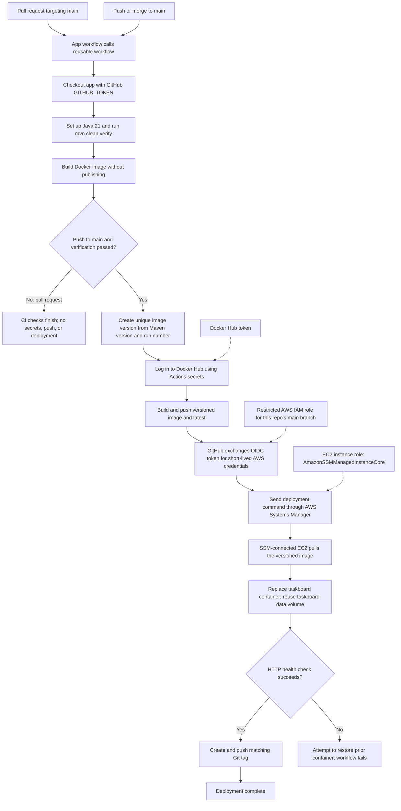

# Taskboard GitHub Actions and EC2 setup

Follow these steps in order: prepare AWS/EC2, prepare Docker Hub, enable
Systems Manager, configure GitHub OIDC in AWS, then add the GitHub repository
variables and secret last.

## What the workflow does

The app repository workflow is
[`../.github/workflows/taskboard.yml`](../.github/workflows/taskboard.yml).
It calls the reusable workflow in
[`Roobini-code/ci-cd-pipelines`](https://github.com/Roobini-code/ci-cd-pipelines),
at `.github/workflows/taskboard-java.yml`.

| Event | What happens |
| --- | --- |
| Pull request targeting `main` | Checks out the app, runs `mvn clean verify`, and builds the Docker image. It does not publish or deploy. |
| Push to `main` (including a merge) | Verifies and builds, publishes a versioned image and `latest` to Docker Hub, assumes an AWS role with GitHub OIDC, deploys the versioned image through Systems Manager, checks the HTTP endpoint, and creates a Git tag. |

The image tag uses the Maven project version plus the GitHub run number and
attempt, for example `1.0.0-42.1`; the corresponding Git tag is
`v1.0.0-42.1`. The EC2 deployment keeps the `taskboard-data` Docker volume so
the H2 database survives container replacement.

**Every push to `main` deploys.** Protect `main` and require reviewed pull
requests before enabling this pipeline for production.

### Pipeline flow



Pull-request verification does not need deployment credentials. For a merge
deployment, image publishing happens before the SSM deployment; the Git tag is
created only after EC2 passes its health check. No inbound SSH from GitHub
Actions is needed.

## Do I need a GitHub PAT for Actions to clone the app?

No. `actions/checkout` uses GitHub's automatically provided, short-lived
`GITHUB_TOKEN` to check out the application repository. The PAT you use from
your PC to push workflow files is only for your local Git operation; do not
save it as an Actions secret.

The reusable workflow repository must be public, or its Actions settings must
allow `java-project` to use its workflows. This does not require adding your
personal PAT to the app repository.

The deployment uses GitHub OIDC to assume a restricted AWS IAM role and send
the deployment command through Systems Manager. It does not use a long-lived
AWS access key or an EC2 SSH key in GitHub Actions secrets.

## Step 1: Create and secure your AWS account

1. Sign in to an AWS account you are authorized to use. Enable MFA and do not
   use the root account for routine administration.
2. Select the AWS Region where you want the server.
3. Before creating resources, review AWS pricing and create a billing budget
   or alert. EC2 compute, EBS disk, public IPv4 addresses, and network usage
   can incur charges. A budget alerts you; it does not automatically cap
   charges.

## Step 2: Launch the EC2 server

In the AWS Console:

1. Open **EC2 → Instances → Launch instances**.
2. Name: `taskboard-ec2`.
3. **Application and OS Images**: select **Amazon Linux 2023**, 64-bit x86.
4. **Instance type**: choose an available type such as `t3.small`. Check
   pricing and your account's service quotas.
5. **Key pair (login)**: create a key pair, select RSA and `.pem`, and
   download the file. Store it securely on your PC. AWS will not provide the
   private key again. Never commit or upload it to a source repository.
6. **Network settings**: create a new security group with these inbound rules:

   | Type | Port | Source |
   | --- | ---: | --- |
   | SSH | 22 | Your current public IPv4 address only (`your-ip/32`) for PC administration. |
   | HTTP | 80 | Your current public IPv4 address only (`your-ip/32`) for initial private testing. |

   Do not allow SSH from `0.0.0.0/0`. Do not add an inbound rule for port
   `8080`; Docker maps public port 80 to the container's port 8080. Taskboard
   does not have authentication, so do not expose HTTP publicly unless you
   intend anyone on the internet to access it.

7. Enable **Auto-assign public IP**. Keep outbound access enabled so the
   instance can download packages and pull a public image from Docker Hub.
8. In **Configure storage**, use the default root disk under **EBS volumes**,
   or adjust its size (for example, 20 GiB gp3) if needed. EC2 needs an EBS
   root volume for Amazon Linux; it is normally created and attached
   automatically during launch. **Do not create an EFS file system for this
   app.** EFS is a separate, network file system and this deployment does not
   use or mount it. If you are looking at the EFS console and see only EFS,
   return to **EC2 → Instances → Launch instances → Configure storage**.
   Review the EBS monthly price before launching.
9. No IAM role is required to launch the instance. You will create and attach
   an EC2 Systems Manager role in Step 5.
10. Review and launch. Wait for **Instance state: Running** and both instance
    status checks to pass. Copy the instance's **Public IPv4 DNS** or **Public
    IPv4 address** and note the instance ID (`i-...`) and Region. The instance
    ID and Region will be repository variables in Step 8; the public IP is for
    optional manual SSH and browser access only, not Actions deployment.

If you stop and start the instance, its public IP and DNS name may change.
Update any browser bookmarks or manual SSH command if they change. An Elastic
IP can preserve the address, but may incur charges. The GitHub Actions SSM
deployment uses the EC2 instance ID, not its public IP.

## Step 3: Install and verify Docker on EC2

On your Windows PC, open PowerShell. Replace the key file path and public IP
with your actual values:

```powershell
ssh -i "$HOME\Downloads\taskboard-key.pem" "ec2-user@<EC2-PUBLIC-IP>"
```

On first connection, verify that the host is your newly launched instance
before accepting its SSH host key. In the EC2 terminal, install Docker and
`curl`:

```bash
sudo dnf update -y
sudo dnf install -y docker curl
sudo systemctl enable --now docker
command -v docker
sudo docker --version
sudo systemctl is-active docker
```

Both `command -v docker` and `sudo docker --version` should confirm Docker is
installed, and `sudo systemctl is-active docker` should print `active`. If
installation reports an error, resolve that before continuing. These commands
are for the Amazon Linux EC2 SSH terminal, not local Windows PowerShell.

The workflow uses `sudo docker`, so do not add `ec2-user` to the Docker group.
Keep the SSH terminal available for Step 5, where you will enable the Systems
Manager agent and verify the instance is managed by AWS.

## Step 4: Prepare Docker Hub

1. Sign in to Docker Hub and confirm the repository
   [`roobinidevops/taskboard-java`](https://hub.docker.com/repository/docker/roobinidevops/taskboard-java)
   exists and the account can publish to it.
2. Set the image repository to **Public**. The current workflow logs in on the
   GitHub runner to push images, but EC2 does not log in to Docker Hub to pull
   them. A private repository will therefore fail during deployment unless
   the workflow is extended to authenticate on EC2.
3. Create a Docker Hub access token with **Read & Write** permission. Save it
   in a password manager until Step 8. Do not use your Docker Hub account
   password or paste the token into a command.

## Step 5: Enable AWS Systems Manager on EC2

The deployment uses Systems Manager (SSM), not SSH. GitHub Actions sends a
command through AWS, and the SSM agent on EC2 receives it over an outbound
HTTPS connection. This avoids opening SSH to GitHub-hosted runners.

### 5.1 Give the EC2 instance its SSM role

1. In the AWS Console, open **IAM → Roles → Create role**.
2. Select **AWS service** as the trusted entity and **EC2** as the use case.
3. Attach the AWS-managed policy `AmazonSSMManagedInstanceCore`.
4. Name the role `TaskboardEC2SSMRole`, review, and create it.
5. Open **EC2 → Instances**, select `taskboard-ec2`, then choose **Actions →
   Security → Modify IAM role**.
6. Attach `TaskboardEC2SSMRole` and save. This is an instance profile for the
   EC2 machine; it is separate from the GitHub Actions role configured below.

### 5.2 Ensure the SSM agent is running

Amazon Linux 2023 normally includes the SSM agent. In the EC2 SSH terminal,
run:

```bash
sudo systemctl enable --now amazon-ssm-agent
sudo systemctl is-active amazon-ssm-agent
```

The second command should print `active`. If systemd says the unit is missing,
install the Amazon Linux package and retry:

```bash
sudo dnf install -y amazon-ssm-agent
sudo systemctl enable --now amazon-ssm-agent
```

In AWS, open **Systems Manager → Fleet Manager** (or **Managed nodes**) in
the same Region as the EC2 instance. Wait until this instance appears as
online/connected. If it does not appear, confirm the instance role is attached
and its security group permits outbound HTTPS (TCP 443). The instance needs
outbound access to the regional SSM service endpoints; with the public subnet
Internet Gateway route and default outbound rule, it can use its internet
connection.

### 5.3 Security-group rules for SSM deployment

GitHub Actions will not SSH to EC2. Do not add a GitHub runner SSH rule and do
not set SSH source to `0.0.0.0/0`.

- Keep SSH TCP `22` restricted to **My IP** only if you want to administer the
  machine manually from your PC. You may remove the SSH inbound rule after
  confirming SSM works, if you no longer need direct SSH.
- Keep HTTP TCP `80` restricted to your public IP (`/32`) for private app
  testing. Only widen HTTP access if you intend to make this unauthenticated
  app public.
- Keep outbound HTTPS (TCP `443`) enabled so the SSM agent can reach AWS and
  EC2 can pull the public Docker image.

No fixed GitHub runner IP is required. Your earlier `github.com:22` test
doesn’t affect this SSM path.

## Step 6: Create the GitHub OIDC role in AWS

This is a separate IAM role for GitHub Actions. It allows only the
`Roobini-code/java-project` repository's `main` branch to request short-lived
AWS credentials. Do not create IAM access keys.

### 6.1 Create the GitHub OIDC identity provider (once per AWS account)

1. Open **IAM → Identity providers → Add provider**.
2. Provider type: **OpenID Connect**.
3. Provider URL: `https://token.actions.githubusercontent.com`.
4. Audience: `sts.amazonaws.com`.
5. Add/create the provider.

If this provider already exists in the AWS account, reuse it; do not create a
duplicate.

### 6.2 Create a least-privilege policy

Find your AWS account ID in the AWS Console account menu. Note the Region,
account ID, and EC2 instance ID (format `i-...`). Replace the three
placeholders in this policy before creating it under **IAM → Policies → Create
policy → JSON**:

```json
{
  "Version": "2012-10-17",
  "Statement": [
    {
      "Sid": "SendTaskboardDeploymentOnlyToItsInstance",
      "Effect": "Allow",
      "Action": "ssm:SendCommand",
      "Resource": [
        "arn:aws:ssm:<REGION>::document/AWS-RunShellScript",
        "arn:aws:ec2:<REGION>:<ACCOUNT_ID>:instance/<INSTANCE_ID>"
      ]
    },
    {
      "Sid": "ReadAndCancelDeploymentCommand",
      "Effect": "Allow",
      "Action": [
        "ssm:GetCommandInvocation",
        "ssm:CancelCommand"
      ],
      "Resource": "*"
    }
  ]
}
```

Name the policy `TaskboardGitHubDeployPolicy`. For example, the instance
details shown earlier use Region `us-east-2`; use the actual Region and
instance ID shown in **your** EC2 console.

### 6.3 Create the GitHub Actions IAM role

1. Open **IAM → Roles → Create role**.
2. Select **Web identity**.
3. Identity provider: `token.actions.githubusercontent.com`.
4. Audience: `sts.amazonaws.com`.
5. If the wizard shows **GitHub organization**, enter `Roobini-code`. This is
   the GitHub owner shown in the app URL
   `github.com/Roobini-code/java-project`—not an AWS organization and not your
   local computer username.
6. If shown, set **GitHub repository** to `java-project` and **GitHub branch**
   to `main`. Do not leave these set to `*`; restricting the role to the app's
   main branch is important.
7. Continue to the permissions step. If the wizard lets you attach
   `TaskboardGitHubDeployPolicy`, attach it. If the wizard instead generates
   its own trust relationship or requires a permission policy before role
   creation, complete the role creation and then edit the role's trust
   relationship and attach the policy as described below.
8. Verify that the role's trust relationship matches this policy, replacing
   `<ACCOUNT_ID>` with your 12-digit AWS account ID:

   ```json
   {
     "Version": "2012-10-17",
     "Statement": [
       {
         "Effect": "Allow",
         "Principal": {
           "Federated": "arn:aws:iam::<ACCOUNT_ID>:oidc-provider/token.actions.githubusercontent.com"
         },
         "Action": "sts:AssumeRoleWithWebIdentity",
         "Condition": {
           "StringEquals": {
             "token.actions.githubusercontent.com:aud": "sts.amazonaws.com",
             "token.actions.githubusercontent.com:sub": "repo:Roobini-code/java-project:ref:refs/heads/main"
           }
         }
       }
     ]
   }
   ```

9. Attach the customer-managed policy `TaskboardGitHubDeployPolicy` if you
   have not already attached it, and name the role
   `TaskboardGitHubActionsDeployRole`.
10. Open the new role's **Summary** and copy its **ARN**. It has the form
   `arn:aws:iam::<ACCOUNT_ID>:role/TaskboardGitHubActionsDeployRole`. Keep it
   for the GitHub repository variable in Step 8.

The trust policy restricts assumption to the app repository's `main` branch.
The deployment job also requests GitHub's `id-token: write` permission; this
permission issues a short-lived OIDC token, not a stored AWS key.

## Step 7: Configure the GitHub repositories

In `java-project`:

1. Open **Settings → Actions → General**. Ensure Actions are enabled and
   workflow permissions allow the caller workflow to write repository
   contents; it needs this permission to create and push Git tags.
2. Protect the `main` branch or create a ruleset requiring pull requests.
   Every push to `main` runs the deployment.

In `ci-cd-pipelines`:

1. Confirm `.github/workflows/taskboard-java.yml` is pushed to its `main`
   branch.
2. If it is private, open **Settings → Actions → General → Access** and allow
   `java-project` to use its reusable workflows. If public, confirm the app
   repo's Actions policy permits using workflows from it.
3. The app currently references the reusable workflow at `@main`. For
   production, pin this reference to a reviewed version tag or commit SHA.

## Step 8: Add GitHub repository variables and secrets

In the **`Roobini-code/java-project` app repository**, open
**Settings → Secrets and variables → Actions → Variables**. Create these
repository variables (they are identifiers, not credentials):

| Variable name | Value |
| --- | --- |
| `AWS_REGION` | Region containing EC2, for example `us-east-2`. |
| `EC2_INSTANCE_ID` | The target instance ID, format `i-...`. |
| `AWS_ROLE_ARN` | ARN copied from `TaskboardGitHubActionsDeployRole` in Step 6. |

Then select **Secrets → New repository secret** and add the Docker Hub
credentials:

| Secret name | Value |
| --- | --- |
| `DOCKERHUB_USERNAME` | Docker Hub username with permission to push the image; currently `roobinidevops`. |
| `DOCKERHUB_TOKEN` | The Docker Hub **Read & Write** token created in Step 4. This is not a GitHub PAT. |

Create all three variables and both secrets in `java-project`; do not add them
to `ci-cd-pipelines`. No EC2 IP, SSH private key, host key, AWS access key, or
AWS console password is stored in GitHub Actions for this SSM deployment. The
Docker Hub repository must be **Public** so EC2 can pull the published image
without Docker Hub credentials.

If you added `EC2_HOST`, `EC2_SSH_PRIVATE_KEY`, or `EC2_KNOWN_HOSTS` while
following an earlier SSH-based version of this guide, remove those unused
secrets after switching the workflow to SSM.

## Step 9: Run the pipeline and verify it

1. Push the app workflow and guide to a feature branch and create a PR
   targeting `main`.
2. Open the PR's **Checks** tab. Confirm both Maven verification and the
   Docker image build pass. PRs do not publish images or deploy.
3. Before merging, confirm the EC2 instance appears online in Systems Manager
   and the AWS role, policy, repository variables, and Docker Hub secret are
   configured.
4. Merge the PR. A push to `main` should run verification again, publish the
   versioned image and `latest`, deploy the versioned image, check the app over
   HTTP, and create a Git tag.
5. In the app repository's **Actions** tab, inspect the run. Confirm the
   versioned image appears in Docker Hub, `taskboard` is running on EC2, the
   EC2 HTTP endpoint returns a successful response, and the matching Git tag
   exists.

## Troubleshooting

| Problem | What to check |
| --- | --- |
| Actions cannot find/call the reusable workflow | Confirm the workflow path and branch, repository name, and cross-repository Actions access. |
| Docker push says token has insufficient scopes | Replace `DOCKERHUB_TOKEN` with a Docker Hub token having Read & Write permission. |
| SSM says the instance is not online or is not a managed node | Confirm `TaskboardEC2SSMRole` with `AmazonSSMManagedInstanceCore` is attached, the agent is active, and outbound TCP 443 can reach SSM endpoints. |
| AWS OIDC role assumption fails | Check the role ARN variable, `id-token: write` permission, OIDC provider audience, and exact repo/branch in the IAM trust policy. |
| `ssm:SendCommand` access denied | Confirm `TaskboardGitHubDeployPolicy` has the correct Region, account ID, instance ID, and AWS-RunShellScript document ARN. |
| Docker pull denied on EC2 | Confirm the Docker Hub image repository is Public. The current deploy workflow does not log in to Docker Hub on EC2. |
| Container is unhealthy | On EC2, run `sudo docker ps` and `sudo docker logs --tail=100 taskboard`. The workflow attempts to restore the prior image after a failed health check. |
| Push of `.github/workflows/taskboard.yml` rejected | This is your local Git credential, not Actions. A classic PAT needs `workflow` (and `repo` for private repos); a fine-grained PAT needs `Contents: Read and write` and `Workflows: Read and write`. Replace the cached Git credential and push again. |
| Git tag push rejected | Confirm the workflow has `contents: write` and repository rules permit Actions to create tags. |

For manual AWS provisioning details, see
[`EC2-DEPLOYMENT-GUIDE.md`](../EC2-DEPLOYMENT-GUIDE.md).
